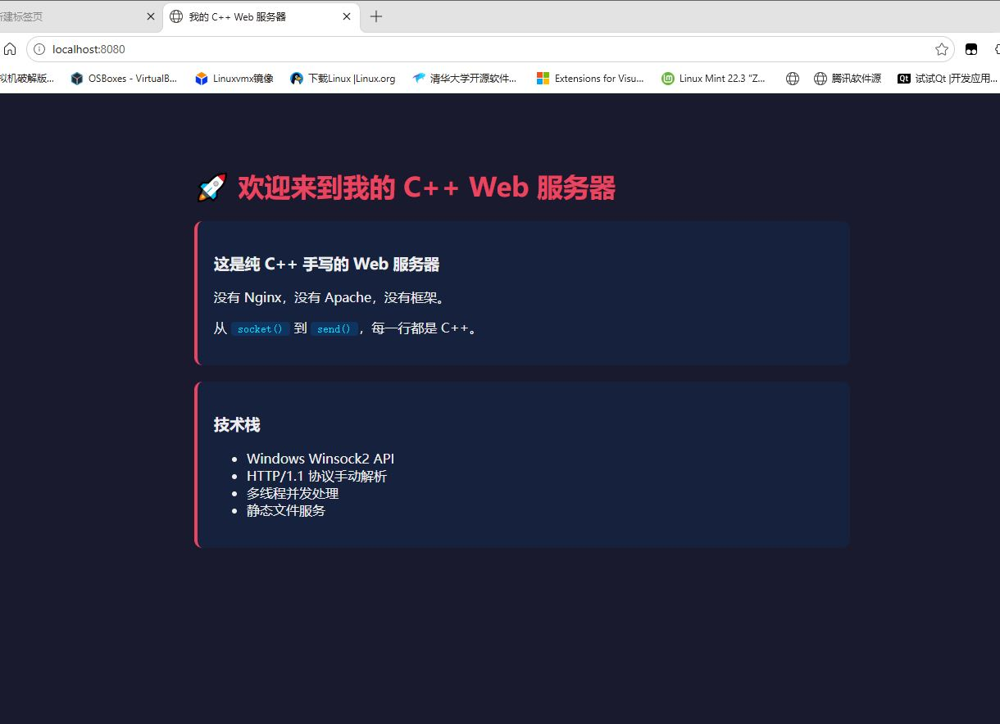
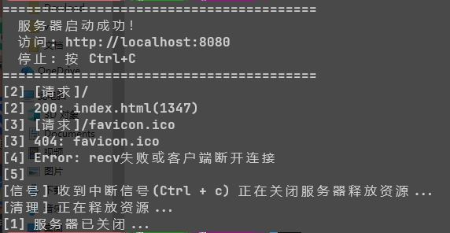

```markdown
# web_server

一个基于 **Winsock2** 的轻量级多线程 HTTP Web 服务器，使用 `C++17` 编写，支持静态文件托管和基本的 `HTTP/1.1` 请求处理。

---





## 功能特性

- **多线程并发处理**：每个客户端连接独立线程处理，支持高并发访问
- **静态文件服务**：自动识别并返回 `HTML`、`CSS`、`JS`、图片等静态资源
- **MIME 类型自动识别**：根据文件扩展名自动设置 `Content-Type`
- **404 错误处理**：文件不存在时返回友好的 `404` 页面
- **优雅关闭**：支持 `Ctrl+C` 信号安全释放资源并退出
- **线程安全日志**：带线程 ID 的实时请求日志输出
- **UTF-8 支持**：完整支持中文内容显示

---

## 支持的文件类型

| 扩展名 | MIME 类型 |
|--------|-----------|
| `.html`, `.htm` | `text/html` |
| `.css` | `text/css` |
| `.js` | `application/javascript` |
| `.png` | `image/png` |
| `.jpg`, `.jpeg` | `image/jpeg` |
| `.gif` | `image/gif` |
| `.ico` | `image/x-icon` |
| 其他 | `text/plain` |

---

## 编译与运行

### 环境要求

- `Windows` 操作系统
- `MinGW-w64` / `MSVC` / 任何支持 `C++17` 的编译器
- 已安装 `ws2_32` 库（Windows 自带）

### 编译

```bash
g++ -std=c++20 main.cpp -lws2_32 -o web_server.exe
```

### 运行

```bash
web_server.exe
```

服务器启动后将监听 **`8080`** 端口。

### 访问

打开浏览器，访问：

```
http://localhost:8080
```

默认会加载 `index.html`（如果存在）。

### 停止服务器

在终端窗口中按 **`Ctrl+C`**，服务器会主动清理资源后安全退出。

---

## 项目结构

```text
.
├── web_server.cpp      # 主程序源码
├── web_server.exe      # 编译后的可执行文件（Windows）
├── index.html          # 默认首页（需自行创建）
├── style.css           # 样式文件（可选）
├── script.js           # 脚本文件（可选）
└── ...                 # 其他静态资源文件
```

&gt; **注意**：服务器会在当前工作目录查找请求的文件。例如访问 `/style.css`，程序会读取 `./style.css`。

---

## 核心模块说明

### 1. 日志系统 `log()`

```cpp
void log(const std::string& msg);
```

输出带线程 ID 的日志信息，便于调试多线程并发问题。

### 2. 文件读取 `sReadFile()`

```cpp
std::string sReadFile(const std::string& path);
```

使用 `std::ostringstream` 和 `rdbuf()` 高效读取整个文件内容到内存，原地操作节省开销。

### 3. HTTP 请求解析 `sParsePath()`

```cpp
std::string sParsePath(const std::string& result);
```

解析 HTTP 请求行（如 `GET /index.html HTTP/1.1`），提取请求路径。

### 4. MIME 类型识别 `sGetContentType()`

```cpp
std::string sGetContentType(const std::string& path);
```

根据文件扩展名返回对应的 MIME 类型。未知类型默认返回 `text/plain` 以防止 **XSS 注入攻击**。

### 5. HTTP 响应构造 `sBuildResponse()`

```cpp
std::string sBuildResponse(
    int iStatusCode, 
    const std::string& sContentType, 
    const std::string& sBody
);
```

构造标准 `HTTP/1.1` 响应报文，包含状态码、`Content-Type`、`Content-Length` 和 `Connection` 头。

### 6. 客户端处理 `nHandleClient()`

```cpp
void nHandleClient(SOCKET ClientSocket);
```

- 接收客户端 HTTP 请求（`4KB` 缓冲区）
- 解析请求路径
- 读取对应文件或返回 `404`
- 发送 HTTP 响应
- 关闭客户端套接字

### 7. 信号处理 `nSingalHandle()`

```cpp
void nSingalHandle(int sig);
```

捕获 `SIGINT`（`Ctrl+C`）信号，设置原子标志 `g_running = false`，关闭监听套接字，触发主循环优雅退出。

---

## 技术细节

### Winsock2 初始化

```cpp
WSADATA wsaData;
WSAStartup(MAKEWORD(2, 2), &wsaData);
```

使用 Winsock `2.2` 版本，完成后调用 `WSACleanup()` 释放资源。

### 套接字创建与绑定

```cpp
SOCKET ListenSocket = socket(AF_INET, SOCK_STREAM, IPPROTO_TCP);

sockaddr_in Server_Addr = {};
Server_Addr.sin_family = AF_INET;
Server_Addr.sin_addr.s_addr = INADDR_ANY;  // 监听所有网络接口
Server_Addr.sin_port = htons(8080);        // 端口 8080

bind(ListenSocket, (sockaddr*)&Server_Addr, sizeof(Server_Addr));
```

### 多线程模型

```cpp
std::thread clientThread(nHandleClient, ClientSocket);
clientThread.detach();  // 分离线程，独立运行
```

每个连接创建一个独立线程处理，主线程继续 `accept()` 等待新连接。

### 资源清理

```cpp
closesocket(ListenSocket);
WSACleanup();
```

确保所有套接字正确关闭，Winsock 资源完全释放。

---

## 安全注意事项

- **路径遍历防护**：当前版本直接拼接路径，建议后续添加 `..` 过滤防止目录遍历攻击
- **MIME 类型安全**：未知文件类型强制返回 `text/plain`，防止浏览器执行恶意脚本
- **缓冲区限制**：接收缓冲区固定 `4096` 字节，超大请求可能被截断
- **线程安全**：日志使用 `std::atomic` 和线程 ID 标识，但文件读取无锁保护（只读场景安全）

---

## 待优化方向

- [ ] 添加 **路径遍历攻击防护**（过滤 `../`）
- [ ] 实现 **HTTP Keep-Alive** 长连接支持
- [ ] 添加 **请求方法校验**（目前只处理 `GET`）
- [ ] 支持 **Range 请求**（断点续传）
- [ ] 添加 **访问日志文件** 持久化存储
- [ ] 使用 **线程池** 替代每次创建新线程，降低开销
- [ ] 支持 **HTTPS/SSL** 加密传输
- [ ] 添加 **配置文件** 支持自定义端口和根目录

---

## 作者

- 基于 `Winsock2` API 原生实现
- `C++17` 标准，无第三方依赖

---

## 许可证

本项目为学习演示用途，可自由使用、修改和分发。
```